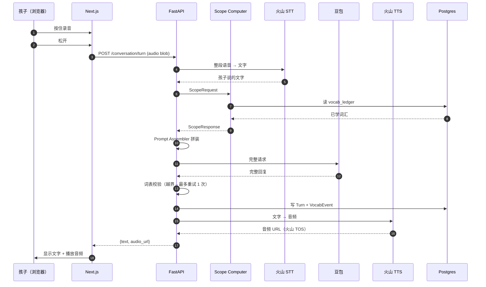
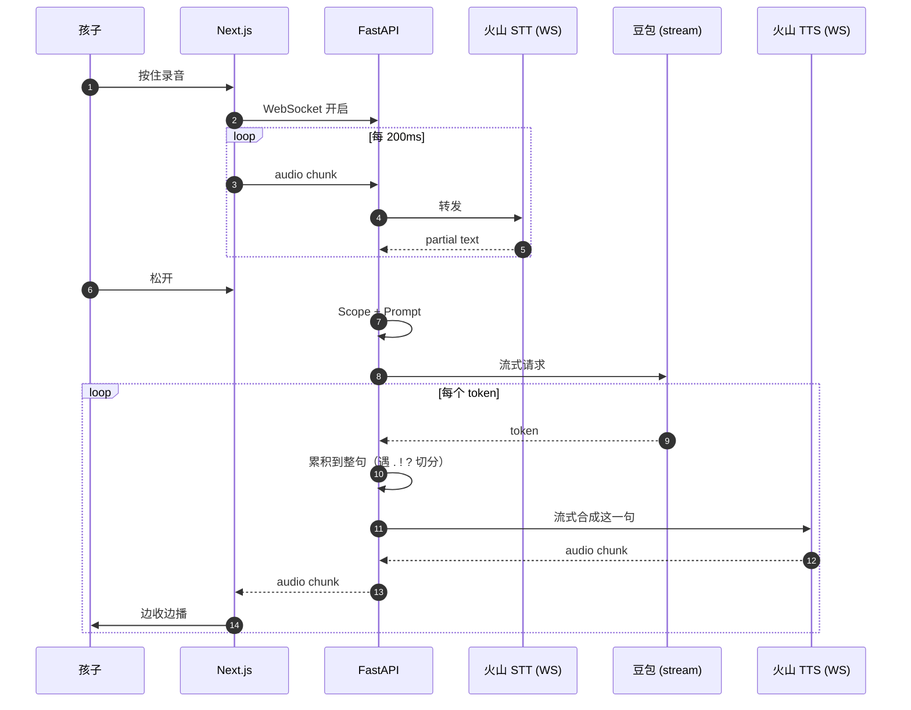

# 技术架构 · Architecture

> 本文档是 V1 架构的设计蓝图。阅读对象：开发者（含 AI 助手）。
> 产品理念见 [`product.md`](product.md)。

---

## 一、技术栈总览

| 层 | 选择 | 备注 |
|---|---|---|
| 仓库组织 | 单仓库，`backend/` + `frontend/` | 根目录 `justfile` 统一任务入口 |
| 后端 | Python 3.12 + FastAPI + SQLAlchemy (async) | asyncpg 驱动 |
| 前端 | Next.js App Router | 全面使用 Next 能力，不当 SPA 写 |
| STT | 火山引擎 · 实时语音识别（英文） | V1 走整段 HTTP；V2 升级流式 WebSocket |
| LLM | 火山方舟 · 豆包 | V1 走整段 SSE；V2 全流式 |
| TTS | 火山引擎 · 儿童音色 | V1 整段；V2 流式边生成边朗读 |
| 主 DB | PostgreSQL 16 | JSONB / pgvector 留给未来 |
| 缓存 | Redis | 会话上下文、限流、token 桶 |
| 对象存储 | 火山 TOS | 音频文件（原音 + 合成语音） |
| 包管理 | backend: Poetry · frontend: pnpm | |
| 任务入口 | 根目录 `justfile` | `just dev` / `just api` / `just web` |
| 容器化 | **V1 延后**，发布阶段再做 | 详见"部署"一节 |

---

## 二、仓库结构

```
talking-text/
├── backend/                       # Python FastAPI
│   ├── app/
│   │   ├── api/                   # HTTP 层（路由 + 请求/响应 schema）
│   │   ├── core/                  # 业务核心（不依赖任何外部 SDK）
│   │   │   ├── scope/             # Scope Computer（范围计算器）
│   │   │   ├── prompt/            # Prompt 组装与校验
│   │   │   ├── dialog/            # 一轮对话的编排
│   │   │   └── mastery/           # V2：掌握度追踪（V1 为空实现）
│   │   ├── adapters/              # 外部服务适配器
│   │   │   ├── stt/
│   │   │   ├── llm/
│   │   │   └── tts/
│   │   ├── curriculum/            # 教材录入管道
│   │   ├── storage/               # DB + 对象存储
│   │   └── main.py
│   └── pyproject.toml
│
├── frontend/                      # Next.js App Router
│   ├── app/
│   │   ├── [locale]/              # Localized routes (zh-CN, zh-TW, en)
│   │   │   ├── layout.tsx         # Localized root layout
│   │   │   ├── page.tsx           # Landing page
│   │   │   ├── login/
│   │   │   └── (app)/             # Authenticated route group
│   │   │       ├── layout.tsx     # App shell + Nav
│   │   │       ├── chat/
│   │   │       └── parent/
│   │   ├── favicon.ico
│   │   └── globals.css
│   ├── i18n/                      # next-intl configuration
│   │   ├── messages/              # JSON dictionaries
│   │   ├── request.ts             # Server configuration
│   │   └── routing.ts             # Navigation helpers (Link, redirect)
│   ├── proxy.ts                   # Auth & i18n middleware (Next.js 16)
│   ├── components/                # Shared components (LocaleSwitcher, etc.)
│   ├── lib/
│   │   └── backend.ts             # Python backend client
│   └── package.json
│
├── docs/
│   ├── product.md                 # 产品理念（双语）
│   └── architecture.md            # 本文档
│
├── justfile                       # 任务入口
├── README.md
├── .gitignore
└── pyproject.toml (将来移入 backend/)  ← 已经完成
```

---

## 三、前端设计：全面 Next.js，不当 SPA 写

选了 Next.js 就吃尽它的优势。**默认 Server Component，只在必须交互处用 Client Component。**

### 每类页面的默认形态

| Page | Rendering Mode | Reason |
|---|---|---|
| Landing `/[locale]` | Server Component | SEO + First-load performance |
| Login `/[locale]/login` | Server Component + Server Action | Form submission without JS |
| Register `/[locale]/register` | Same as above | Same as above |
| App Entrance `/[locale]/(app)/layout.tsx` | Server Component | Auth + User SSR |
| Chat `/[locale]/(app)/chat` | Server Component (shell) + Client Component (audio) | History SSR, audio interactive |
| Parent `/[locale]/(app)/parent` | Server Component | All data SSR |

### 前后端通信

```
Browser → Next.js (Server Component / Server Action / middleware)
              │
              └── server-side fetch → Python FastAPI backend
```

- Next Server 侧通过 `lib/backend.ts` 统一封装对 Python 的 HTTP 调用
- 浏览器直接调用 Python 只在**对话页的音频流**这一条路径（后续 WebSocket）
- **不使用 Next 的 API Routes**（避免多一层转发）
- 鉴权使用 httpOnly cookie + Next middleware 校验

### 对话页的特殊处理

对话页是整个产品里唯一需要实时音频的地方，拆分如下：

```tsx
// app/(app)/chat/page.tsx （Server Component）
export default async function ChatPage() {
  const history = await backend.getConversationHistory()  // SSR 拉数据
  return <ChatClient initialHistory={history} />
}

// app/(app)/chat/ChatClient.tsx （Client Component）
"use client"
export function ChatClient({ initialHistory }) {
  // MediaRecorder + 音频播放 + 实时 UI
}
```

首屏历史数据 SSR 出来（快），交互部分 hydrate 成 Client Component（灵活）。两边各得其所。

---

## 四、数据模型

> **For complete fields, see: [`data-dictionary.md`](data-dictionary.md)**

### 账号与学习者

```
Account（登录 + 计费实体，一个家庭一个）
  ├── email / password
  ├── balance / subscription
  └── owns → [Learner]

Learner（学习档案，每个人一个）
  ├── display_name, age, grade, avatar
  ├── curriculum_progress
  ├── vocab_ledger（派生，可缓存）
  └── conversation_history
```

**关键原则：** 业务逻辑（Scope Computer、mastery tracker）只在 Learner 维度计算，不区分"孩子/家长"。父母想学，加一个 Learner 档案即可。

### 教材（内部规范数据结构）

```python
class Curriculum:
    id: int
    name: str                # "人教版 PEP 3年级上册" / "Tot Talk Book 2"
    publisher: str
    grade: str
    units: list[Unit]

class Unit:
    id: int
    order: int
    title: str               # "Unit 3 — Look at me"
    objectives: list[str]    # 教学目标
    key_points: list[str]    # 重点
    articles: list[Article]
    vocab: list[VocabItem]
    grammar_points: list[GrammarPoint]

class Article:
    text_en: str
    text_cn: str | None
    audio_url: str | None    # 原版朗读（如果有）

class VocabItem:
    word: str
    phonetic: str | None
    part_of_speech: str
    definition_cn: str
    example_en: str
    example_cn: str

class GrammarPoint:
    title: str
    explanation: str
    examples: list[str]
```

**设计原则：** 所有外部输入（PDF / 图片 / 粘贴文本 / 老师录音）最终都转成这份规范结构。转换工作交给 AI（LLM 做结构化提取），人工审阅为准。

### 对话与事件

```
Conversation
  ├── learner_id
  ├── started_at
  └── turns → [Turn]

Turn
  ├── user_text, user_audio_url
  ├── assistant_text, assistant_audio_url
  ├── scope_snapshot (JSONB)   # 本轮用了哪份 scope
  ├── prompt_snapshot (JSONB)  # 排查用
  └── created_at

VocabEvent   ★ V1 写入，V2 才开始读
  ├── learner_id
  ├── conversation_id, turn_id
  ├── word
  ├── event_type: exposed_by_ai | used_by_learner | asked_meaning | ignored
  ├── context: str
  └── created_at
```

**关键纪律：V1 每一轮都要写 VocabEvent，哪怕现在没人读它。** V2 要做 mastery tracker 时，这些数据是唯一来源。V1 不写 → V2 从零开始攒数据 → 产品效果倒退半年。

---

## 五、Scope Computer — 核心灵魂

每一轮对话之前，都必须先问 Scope Computer："这一轮允许用哪些词？"

### 接口（在 V1 就定死）

```python
class ScopeRequest(BaseModel):
    learner_id: int
    conversation_id: int

class ScopeResponse(BaseModel):
    base_vocab: set[str]          # 允许自由使用的词
    stretch_vocab: set[str]       # 可混入的进阶词（V1 为空集）
    stretch_ratio: float          # 进阶词占比上限（V1 = 0.0）
    forbidden_vocab: set[str]     # 明确禁用的词（V1 为空集）
    session_tone: Literal["casual", "curious", "playful"] = "casual"

class ScopeComputer(Protocol):
    def compute(self, request: ScopeRequest) -> ScopeResponse: ...
```

### 版本演进

**V1 — 空壳实现：**
```python
def compute(req):
    return ScopeResponse(
        base_vocab=get_vocab_ledger(req.learner_id),
        stretch_vocab=set(),
        stretch_ratio=0.0,
        forbidden_vocab=set(),
        session_tone="casual",
    )
```

**V2 — 加入 stretch（渐进式学习）：**
```python
def compute(req):
    ledger = get_vocab_ledger(req.learner_id)
    next_unit = get_next_unit_vocab(req.learner_id)
    return ScopeResponse(
        base_vocab=ledger,
        stretch_vocab=next_unit - ledger,
        stretch_ratio=get_parent_config(req.learner_id).stretch_ratio,  # 默认 0.1
        ...
    )
```

**V3 — 接入 mastery tracker（个性化）：**
```python
def compute(req):
    mastered = mastery.get_mastered(req.learner_id)
    struggling = mastery.get_struggling(req.learner_id)
    ...
```

**对外接口永远不变，实现逐代长胖。**

---

## 六、对话一轮的端到端数据流

### V1 串行版（HTTP 全程整段）



### V2 流式版（WebSocket 全程流式）



**V1 → V2 的升级代价：** 只改 orchestrator 和 adapter 的 `stream()` 分支，数据模型和 Scope Computer 接口不动。

---

## 七、范围约束的实现（Level 0 + Level 1）

RAG 对我们这个场景过重，词表又小又结构化，用不上向量检索。两层防线足够：

### Level 0 — Prompt 约束

```
你是一个正在和小朋友练习英语的友好伙伴。
严格要求：
- 只使用以下允许词表（ALLOWED_VOCAB）和基础功能词（is, the, and, to, a, an, I, you, me, my...）
- 如果 STRETCH_VOCAB 非空，你可以偶尔使用其中的词，但占比不得超过 {stretch_ratio*100}%
- 使用 STRETCH 词时，上下文必须让含义从情境中显而易见
- 句子要短、要清晰、要有生活场景

ALLOWED_VOCAB: [...]
STRETCH_VOCAB: [...]
```

**成本控制：** ALLOWED_VOCAB 几百到两千词，开启 prompt caching 后重复命中几乎零成本。

### Level 1 — 事后词表校验

1. 拿到 LLM 返回文本
2. Tokenize（简单 `re.findall(r"[a-zA-Z']+")` 即可）
3. 每个词查表：在 base/stretch/功能词 之内 → 通过；超出 → 记录
4. **轻度越界（1 词）：** 通过但标记
5. **重度越界（≥2 词）：** 带反例重新请求 LLM，最多一次
6. 所有越界写入 `llm_violation_log`，家长后台可见

### 成本估算（V1）

| 项 | 量 |
|---|---|
| 每轮 prompt tokens（缓存命中后）| ~200（未命中 ~1500） |
| 每轮 completion tokens | 50-150 |
| 每轮成本（按豆包定价）| 约 ¥0.001-0.005 |

100 个每日活跃孩子，每人每天聊 10 轮 → 每月 ~¥150-1500。可承受。

---

## 八、教材录入管道

```
┌───────────────────┐   ┌──────────────────────────┐    ┌──────────────┐
│ 粘贴文本 (V1)      │   │ 1. 清洗/分段               │    │              │
│ 大纲/目标 (V1)     │   │ 2. LLM 结构化提取          │    │ Curriculum   │
│ PDF/图片 (V2)     │ → │ 3. JSON Schema 严格校验     │ →  │   └── Unit   │
│ MP3/录音 (V3)     │   │ 4. 家长后台审阅/编辑         │    │              │
└───────────────────┘   └──────────────────────────┘    └──────────────┘
```

### LLM 提取 Prompt 骨架（中文指令 + 英文内容）

```
你是一个小学英语教材结构化助手。
输入：一份教材内容（可能是课文、词表、语法点、教学大纲的混合）。
输出：严格符合下面 JSON Schema 的结构。
要求：
- 只提取原文中明确出现的内容，绝不编造
- 不确定的字段设为 null
- 保留原文英语措辞，不改写
- 词性使用标准缩写（n./v./adj./adv./prep./conj./pron./interj.）

Schema:
{
  "articles": [{"text_en": str, "text_cn": str | null}],
  "vocab": [{"word": str, "part_of_speech": str, "definition_cn": str, "example_en": str}],
  "grammar_points": [{"title": str, "explanation": str, "examples": [str]}],
  "objectives": [str],
  "key_points": [str]
}
```

### V1 录入体验

1. 家长进入"教材管理"
2. 选择已内置教材库 / 新建
3. 粘贴文本 + 填元信息（教材名、年级、单元号、单元标题）
4. 点"AI 提取" → 后端调 LLM 返回结构化 JSON
5. 家长审阅/编辑每个字段
6. 保存 → 写入 DB，计入 vocab ledger

**V1 内置教材：** 暂不预填，等第一批真实教材（Tot Talk 等）到位再作为种子数据。

---

## 九、供应商切换路径（Adapter Pattern）

所有外部服务通过 adapter 隔离。**无论 HTTP / SSE / WebSocket，对外接口一致。**

```python
# adapters/llm/base.py
class LLMAdapter(Protocol):
    async def invoke(self, messages: list[Message], **kwargs) -> str: ...
    async def stream(self, messages: list[Message], **kwargs) -> AsyncIterator[str]: ...

# adapters/llm/doubao.py       ← V1 用这个
class DoubaoAdapter(LLMAdapter): ...

# adapters/llm/deepseek.py     ← 将来可无缝切换
class DeepSeekAdapter(LLMAdapter): ...

# adapters/stt/iflytek.py
class IflytekSttAdapter(SttAdapter): ...  # 内部走 WebSocket
```

业务层依赖注入使用：

```python
# core/dialog/service.py
class DialogService:
    def __init__(self, llm: LLMAdapter, stt: SttAdapter, tts: TtsAdapter, ...):
        self.llm, self.stt, self.tts = llm, stt, tts
```

**切换供应商 = 改 config.yaml 一行：**

```yaml
llm:
  provider: doubao      # → deepseek / qwen / glm
  api_key_env: DOUBAO_API_KEY
stt:
  provider: volcengine  # → iflytek / aliyun
tts:
  provider: volcengine  # → iflytek / azure
```

即便 V2 全流式，adapter 内部协议换成 WebSocket，业务层仍然是同样的 `async for chunk in adapter.stream(...)`。**架构不会锁死供应商，可以任意混搭**（讯飞 STT + DeepSeek LLM + 火山 TTS 等）。

---

## 十、鉴权（V1 简版）

- 登录：邮箱 + 密码，bcrypt 哈希入库
- 会话：httpOnly cookie（session token）+ Redis 存 session 数据
- Next.js 侧：`middleware.ts` 校验 cookie，未登录重定向 `/login`
- 后端侧：FastAPI dependency 从 cookie 读 token，查 Redis 拿 Account
- **V1 不做**：短信验证、微信登录、邮箱验证、2FA
- **V2 再加**：手机号登录（阿里云短信）、微信扫码

---

## 十一、部署 — V1 延后 Docker

**决策：当前（V1 开发阶段）不写 docker-compose，不做容器化。发布前一次性做。**

理由：开发阶段结构频繁变动，每次改都要同步 Dockerfile 成本太高。

**但是**，我们从第一天起就按"最终会 Docker 化"的原则写代码，避免挖坑：

### 必须遵守（即使现在不 Docker）

- ✅ **配置走环境变量或 config 文件**，绝不写死（数据库 URL、API 密钥、端口、对象存储 endpoint）
- ✅ **日志走 stdout/stderr**，不落本地文件（或落文件时仍同时输出 stdout）
- ✅ **所有外部依赖通过网络访问**（DB、Redis、TOS 都是远程服务，不用本地文件系统）
- ✅ **音频等临时文件用 `tempfile` 或上传到 TOS**，不放在项目目录
- ✅ **不依赖 `__file__` 的相对路径**来加载资源
- ✅ **启动时不做文件系统的前置约定**（如"必须在当前目录下有 data/ 文件夹"）
- ✅ **端口、host 可配**，不硬编码 `127.0.0.1`

### 可以接受（现阶段便利）

- ✅ 用 `poetry run uvicorn` / `pnpm dev` 起服务，而不是容器
- ✅ 本地连一个自己装的 Postgres / Redis，或运行单个 `docker run` 容器只起 DB（非 compose）
- ✅ `.env` 文件放在 backend/frontend 根目录，git 忽略

### 发布前一次性补齐

- `backend/Dockerfile`（multi-stage build，python slim 基础）
- `frontend/Dockerfile`（Next.js standalone 输出）
- `docker-compose.yml`（app + postgres + redis 本地复现）
- 生产用 k8s 或简单的 docker compose（看规模再定）

---

## 十二、延后与未决事项

| 事项 | 状态 | 触发条件 |
|---|---|---|
| Docker 化 | 延后 | V1 功能稳定，进入发布筹备 |
| 上云部署（火山云 vs 阿里云）| 未决 | 发布前再定 |
| 流式 STT/LLM/TTS | 延后 | V1 整段体验跑通后 |
| Scope Computer V2（stretch）| 架构预留 | V1 完整上线 + 有真实对话数据 |
| Mastery Tracker | V2/V3 | 事件日志累积 ≥ 3 个月 |
| PDF / 图片 / MP3 教材导入 | 延后 | 文本导入流程跑顺 |
| 短信 / 微信登录 | 延后 | 账号量达到需要降低登录门槛的规模 |
| 儿童数据合规（COPPA / 个保法）| V1 不做但不反 | 准备对外推广前 |
| PWA 离线模式 | V2 | 基础功能完成 |

---

## 十三、设计原则（工程纪律）

1. **先写接口，再写实现。** Scope Computer、各 adapter，接口在 V1 就定死。
2. **Adapter 隔离副作用。** `core/` 里零 SDK 依赖，所有外部调用走 `adapters/`。
3. **事件先写，分析后补。** VocabEvent 这类"现在没人读"的日志，V1 就必须写。
4. **双语注释能少则少。** 代码里注释中英文皆可，but 宁缺毋滥——命名清楚胜过任何注释。
5. **尊重 Next 的范式。** 前端默认 Server Component，不硬写 SPA。
6. **不引入没用到的依赖。** 只加真的用得上的包。
7. **不提前优化。** V1 只保证"能用+正确"，性能优化放在真实瓶颈出现后。
