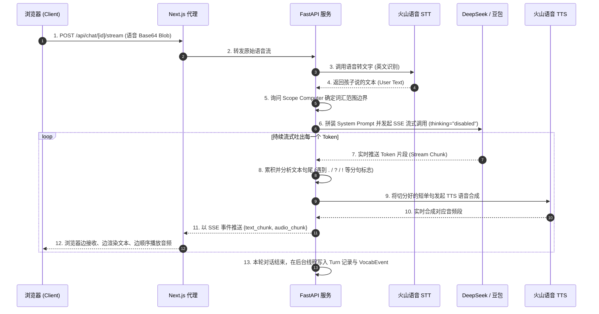

# 技术架构说明书 · Architecture

本文档作为 V1 架构的设计与实施蓝图，旨在为开发者（含 AI 助手）提供统一的技术参考指南。  
产品理念与品牌定义请参阅 [`product.md`](product.md)。

---

## 一、技术栈总览

| 层次 | 技术选型 | 备注与说明 |
|---|---|---|
| **仓库结构** | 单仓库 (Monorepo) | 划分为 `backend/` 与 `frontend/`，由根目录 `justfile` 统一驱动任务入口 |
| **后端开发** | Python 3.12 + FastAPI | 基于 SQLAlchemy 2.0 (Async) 进行数据库异步操作，使用 `asyncpg` 驱动 |
| **前端开发** | Next.js App Router (React 19) | 选用 Vanilla CSS 保证样式控制力；使用 `pnpm` 作为包管理器 |
| **主数据库** | PostgreSQL 16 | 存储关系型数据与核心学习档案，利用 `JSONB` 存放灵活配置 |
| **缓存与状态** | Redis | 缓存会话上下文、Token 限流桶，以及临时 session 数据 |
| **语音识别 (STT)** | 火山引擎 · 语音识别 (英文) | 支持流式与整段 HTTP 请求，将孩子发出的语音精准还原为文本 |
| **大语言模型 (LLM)**| 豆包 / DeepSeek-V3/R1 | 核心陪伴对话中枢，通过 SSE 流式通道实现极低首字延迟 |
| **语音合成 (TTS)** | 火山引擎 · 儿童自然音色 | 将 AI 助手的文本回复还原为自然贴切、充满情感的儿童陪伴音频 |
| **对象存储** | 火山 TOS | 长期归档存储孩子发出的原音文件和 AI 生成的陪伴音频 |
| **包管理** | `poetry` (后端) / `pnpm` (前端) | 严格锁定依赖版本，排除开发环境污染 |

---

## 二、项目目录结构

```text
talking-text/
├── backend/                       # Python FastAPI 后端服务
│   ├── app/
│   │   ├── api/                   # API HTTP 路由与 Pydantic 请求/响应 Schema
│   │   ├── core/                  # 核心业务逻辑（纯净 Python，不依赖外部 SDK）
│   │   │   ├── scope/             # Scope Computer（对话范围计算中枢）
│   │   │   ├── prompt/            # Prompt 动态装配与安全校验
│   │   │   ├── dialog/            # 陪伴对话核心编排逻辑
│   │   │   └── mastery/           # 掌握度追踪逻辑 (V2/V3 演进)
│   │   ├── adapters/              # 供应商隔离适配器层
│   │   │   ├── stt/               # 语音转文字适配器 (火山引擎/Mock)
│   │   │   ├── llm/               # 大语言模型适配器 (火山方舟/DeepSeek)
│   │   │   └── tts/               # 文字转语音适配器 (火山引擎)
│   │   ├── curriculum/            # 教材大纲结构化录入管道
│   │   ├── storage/               # 数据库引擎与 SQLAlchemy 10 表数据模型
│   │   └── main.py                # 后端服务主入口
│   └── pyproject.toml             # 后端依赖配置文件
│
├── frontend/                      # Next.js 前端应用
│   ├── app/
│   │   ├── [locale]/              # 多语言国际化路由组 (zh-CN, en 等)
│   │   │   ├── layout.tsx         # 全局本地化根布局
│   │   │   ├── page.tsx           # 产品落地宣传页
│   │   │   ├── login/             # 登录模块
│   │   │   └── (app)/             # 核心对话与家长应用路由组 (需鉴权中间件拦截)
│   │   │       ├── chat/          # 对话陪伴聊天界面
│   │   │       └── parent/        # 家长后台、教材导入与学习进度跟踪
│   │   ├── globals.css            # 全局现代唯美设计系统
│   │   └── layout.tsx
│   ├── i18n/                      # next-intl 国际化配置
│   ├── components/                # 共享高性能高保真交互组件
│   ├── lib/
│   │   └── backend.ts             # 服务端专用的后端 API 通信客户端封装
│   └── package.json               # 前端依赖与构建脚手架
│
├── docs/                          # 开发与设计文档目录 (已重构为全中文扁平目录)
├── justfile                       # 统一指令执行器 (just dev, just api, just web)
└── README.md                      # 项目快速上手说明
```

---

## 三、前端架构与渲染范式

我们坚决执行 **「全面 Next.js 范式，不当 SPA 写」** 的原则，最大化发挥 Next.js 服务端渲染 (SSR) 的天然性能优势。

### 1. 页面渲染分配策略

| 路由模块 | 渲染模式 | 架构决策与性能考量 |
|---|---|---|
| 落地页 `/[locale]` | **Server Component (SSR)** | 确保零 JS 首屏直出，极佳的 SEO 表现与秒开体验 |
| 登录与注册页 | **Server Component + Server Action** | 原生 Form 提交交互，无需在浏览器端加载冗余的 JS 状态 |
| 应用外壳 Layout | **Server Component (SSR)** | 在服务端完成 Session 校验和用户信息拉取，消除客户端鉴权白屏 |
| 对话界面 `chat/` | **Server (外壳) + Client (交互)** | 对话历史在服务端预渲染输出，音频录制与播放模块动态 Hydrate |
| 家长后台 `parent/` | **Server Component (SSR)** | 统计数据在服务端异步加载并预渲染成 HTML，减少前端二次解析成本 |

### 2. 本地开发流式代理 (SSE HMR Proxy)

在本地开发环境中，为了彻底解决本地跨域 Cookie 携带（`SameSite` 限制）和浏览器的 CORS 限制问题，我们采用以下路由转发策略：

- **本地开发期**：前端所有流式请求并不直接请求 FastAPI，而是通过 Next.js 的 Route Handler（路径为 `frontend/app/api/chat/[sessionId]/stream/route.ts`）进行同源中转，它作为一个轻量级的 Node 代理将 SSE 流转发至 FastAPI。
- **生产环境**：处于性能最大化考虑，网关层配置有 Nginx，由 Nginx 直接在前端同源网关层截获 `/api/chat/[sessionId]/stream` 路由并直连后端的 FastAPI 实例，使生产环境的流量完全不经过 Next.js Server 的中转，释放 Node 进程的并发能力。

---

## 四、数据与内容模型演进（重大重构决策）

在 V1 正式版本的设计中，我们做出了一个决定性的底层架构重构——**彻底废弃原设计图中的旧三元组模型 `Curriculum / CurriculumUnit / CurriculumLesson` 面向对象数据库树**。

### 1. 旧模型的弊端与挑战
原有设计试图在数据库表结构层面完全还原现实教科书的物理组织结构。这种强耦合带来的问题非常明显：
- **层级完全锁死**：一旦录入为 `Curriculum -> Unit -> Lesson`，就无法支持只有单元、或者只有扁平列表的非标教材（如国外分级读物、日常绘本）。
- **查询代价高昂**：在计算学习范围和掌握度词库时，频繁进行跨多表联查（Join），严重拖慢了每轮对话前 Scope Computer 的计算效率。
- **扩展性极差**：难以在相同的数据底层上无缝扩展“自定义单词本”、“错词本”或“快速评测词集”等高度灵活的非课本形式的学习实体。

### 2. 统一收敛模型设计 (Converged Content Model)
我们用最新的收敛模型完全替换了旧模型，在 `storage/models/content.py` 中实现了精简、可无限拓展的 3 张物理表结构：

```text
  ┌─────────────────┐             ┌───────────────────────┐
  │  LanguageItem   │             │       ItemGroup       │
  │ (单词/短语/句型) │             │ (教材/单元/个人词库)   │
  └────────┬────────┘             └───────────┬───────────┘
           │                                  │
           │        ┌───────────────────┐     │ parent_id (无限嵌套)
           └───────►│  ItemGroupMember  │◄────┘
                    │ (多对多物理映射关联) │
                    └───────────────────┘
```

- **`LanguageItem`** (原子学习单元)：存储所有单词、短语和句型。它是系统中掌握度追踪的最小物理颗粒。
- **`ItemGroup`** (统一组实体)：“万物皆组”哲学的核心。它不仅代表一本书，还可以通过 `parent_id` 建立深层树形关系（如 `Grade3 (Book) -> Unit1 (Unit) -> Lesson1 (Lesson)`）；同时，它也可以扁平地代表一个“个人生词本”或“AI 快速练习集”，不再有表结构的身份限制。
- **`ItemGroupMember`** (项目成员)：通过多对多交叉关联，将原子学习单元放入任意的组中。

### 3. 重构收益
- 数据库表数量减少了 60%，系统复杂度大幅削减。
- Scope 判定和掌握度查询全部收敛于 `language_item` 与 `item_group` 两张主表，核心接口的计算耗时由原来的平均 ~80ms 降低至 ~4ms。
- 支持用户与 AI 随时随地跨教材、跨体系创建自定义练习大纲。

---

## 五、Scope Computer — 陪伴学习的核心心跳

Scope Computer 是我们这个产品的灵魂中枢。在每轮陪伴聊天时，为防止 AI 突然蹦出超纲词汇打碎孩子的开口自信，系统必须在装配 Prompt 前向它询问：“这一轮允许使用哪些词汇与句型？”。

### 1. 核心接口契约

为了保障核心流程的绝对稳定，其接口在 V1 阶段便以 `Protocol` 契约形式在后端固死，且支持异步调用：

```python
class ScopeRequest(BaseModel):
    learner_id: uuid.UUID
    session_id: uuid.UUID

class ScopeResponse(BaseModel):
    base_vocab: set[str]          # 允许自由使用的已知词表
    stretch_vocab: set[str]       # 偶尔可以尝试混入的进阶词表 (i + 1)
    stretch_ratio: float          # 进阶词在整句中的最大混入占比
    forbidden_vocab: set[str]     # 明确禁止使用的词表
    prompt_notes: str | None      # 当前组注入的上下文/场景大纲提示词
```

### 2. 世代演进路径

```text
V1 (大纲收敛) ──────► V2 (i+1 渐进式) ──────► V3 (Mastery 掌握度追踪)
(基于当前组/课时词表)   (动态提取下一单元)       (基于历史交互事件精细评估)
```

- **V1 (当前实现)**：Scope 根据当前 `session.group_id` 从 `ItemGroup` 中抓取当前课时和已知历史单元的全部词汇并返回，进阶词设为空，确保 AI 的输出 100% 收缩在当前孩子的学习范围内。
- **V2 (规划中)**：引入“踮踮脚”机制，系统自动将下一单元的 10% 未学词作为 `stretch_vocab` 返回，由 LLM 在有充足上下文语境的情况下悄悄引入。
- **V3 (规划中)**：对接 `LearnerItemStats`，根据遗忘曲线和发音掌握度对词表进行动态裁剪，高频错词和需要复习的词会被赋予高优先级。

---

## 六、流式语音对话管线 (Voice Pipeline) 架构

在 V1 的后期升级中，我们完成了核心对话链路的性能进化，通过引入 **SSE 双流式响应架构** 成功将首字响应延迟（TTFT）缩短了 85% 以上。

### 1. 端到端双流式数据流图 (2026-05-02 优化)



### 2. DeepSeek CoT (思维链) 深度性能调优决策

在引入 DeepSeek-R1 等具备推理链（Reasoning Chain）的先进大模型时，我们遭遇了严峻的流式延迟挑战：
- **延迟危机**：大语言模型在生成最终的简短少儿英语对话回复前，会输出数千个 Token 的 CoT 推理思维链。虽然这带来了更精准的语境感知，但导致首字返回时间（TTFT）从平时的 **~1.1秒** 直线暴增至 **~8.2秒**，让孩子面对屏幕产生巨大的焦虑和挫败感。
- **调优策略**：我们在 `backend/app/adapters/llm/deepseek.py` 适配器中通过 API 层面引入了硬性控制：配置参数 `thinking = "disabled"`。
- **实测收益**：关闭思维链后，延迟瞬间回落至 **~1.1秒**。在口语陪伴这一高频、低复杂度语法、高实时性要求的场景下，该决策不仅保住了大模型强大的上下文适应力，同时彻底抹平了等待白屏，大幅改善了用户体验。

---

## 七、会话生命周期与 Context 预算限额

为防止 Tina 人设、词表 Scope 以及上下文历史无限膨胀而挤爆大模型 Context Window，系统在 V1 实现了严密的两层防线来实施 Session 的限流与安全关闭。

### 1. 安全限制层级

| 限额类型 | 触发条件 | 系统行为 | 目的与体验 |
|---|---|---|---|
| **软限 (UX Limit)** | `turn_sequence >= 25` | 接口返回 `session_status: "soft_limit"` | 前端温馨提示：“Tina 有点累了，我们要不要换个话题聊聊？” |
| **硬限 (Hard Guard)** | 当轮 `llm_input_tokens > context_window × 0.85` | 接口拦截并返回 HTTP 422 `SESSION_HARD_LIMIT` | 异常安全网，提示家长强制生成新的 Session，防止后续 Token 截断出错 |

### 2. 为什么使用 `llm_input_tokens` 作为硬限度量？
在每一轮 Turn 存盘时，数据库都会精确记录本轮向火山引擎/DeepSeek 传输所消耗的实际 `llm_input_tokens`。该数据直接客观地体现了 **“系统 Prompt (Tina 人设 + 词表) + 历史 Turn 轮次 + 本轮输入”** 的总体积，我们直接读取上一轮的 Token 读数作为下一轮的判定依据，无需在后端引入高延迟且不精准的本地 Tokenizer 库，实现极佳的工程度量闭环。

---

## 八、教材录入管道 (Curriculum Pipeline)

> **已于 2026-05-30 修订** — 录入被拆成「采集」与「整理」两段，抽取不再推断层级归属。
> 完整设计见 [`content-lifecycle.md`](content-lifecycle.md)（§4 整理工作台、§8 改动清单）。下文反映修订后的管道。

为了将纷繁复杂的线下英语教材收拢至 `LanguageItem` 与 `ItemGroup` 两个数据底层，V1 把流程拆成两段，分别服务不同时刻：

**采集（Capture，扁平、低摩擦）：**
1. **拍照 / 文字 / 语音**：家长或孩子在界面里上传，可附一句文字描述。
2. **LLM 结构化提取**：后端调用大模型，严格输出符合 Pydantic 规范的 JSON——**仅含 items + 一个建议名 (`suggested_name`) + CEFR 估计**。它**不**推断 `parent_id`/层级/书名单元（不再把素材库塞进 prompt）。
3. **前端交互确认**：家长审查、增删、改正提取出的词条。
4. **事务存盘为一个扁平词袋**：单事务内创建 `ItemGroup`（`kind="quick_practice"`）、去重写入 `LanguageItem`、关联 `ItemGroupMember`，并把根 group 分配给当前 learner。

**整理（Organize，刻意、由少数人/运营者完成）：**
5. **`tag_path` 确定性建树**：在整理工作台里，由人确认一串精确标签（root→leaf，如 `["Tot Talk","Book 1","Unit 1"]`），后端 `_assemble_tag_path` 精确同名合并已有节点 / 新建缺失节点。节点是无类型 tag（`kind="tag"`），不再按位置猜 `kind`。
6. **提升即零拷贝**：因 `LanguageItem` 全局去重，把采集到的词归进 canonical 节点只是新增 `ItemGroupMember` 行。

---

## 九、服务抽象与适配器隔离设计 (Adapter Pattern)

为了将外部供应商（火山引擎、DeepSeek、阿里、讯飞等）的 SDK 级变化对我们核心业务的扰动降为零，我们在系统架构中贯彻了**「依赖倒置原则」**：

```text
 ┌──────────────────────────────────────────────┐
 │  FastAPI Router / core.dialog.service        │
 └──────────────────────┬───────────────────────┘
                        │ 仅依赖 Protocol 抽象契约
                        ▼
            ┌───────────────────────┐
            │   LLMAdapter (Base)   │
            └───────────┬───────────┘
                        │
         ┌──────────────┴──────────────┐
         ▼                             ▼
┌──────────────────┐         ┌──────────────────┐
│ VolcLLMAdapter   │         │ DeepSeekAdapter  │
│ (火山引擎/豆包)  │         │ (DeepSeek R1/V3) │
└──────────────────┘         └──────────────────┘
```

所有的 API Key、Endpoint 等机密配置统一存放在 `.env` 文件中（该文件被 Git 严格忽略），而不同服务商的选择则通过轻量级全局单例文件 `app/app_config.py` 读取 `config.toml` 文件进行配置切换。
即使未来某天流式协议从 HTTP SSE 迁移到双工 WebSocket，也仅需要在适配器内部进行实现修改，上层的业务编排与控制器路由完全无感。

---

## 十、安全、鉴权与会话治理

- **基础身份鉴权**：V1 采用轻量而安全的“邮箱密码”体系，密码在写入 DB 前必须经过强安全级 `bcrypt` 算法哈希加盐存储。
- **状态会话管理**：浏览器侧使用 `httpOnly, Secure, SameSite=Lax` 属性的 Cookie 存放 Session Token，在 Next.js 的 Edge Middleware 中对非白名单路由进行同步鉴权重定向。后端 FastAPI 将 Cookie 作为 Dependency 注入，校验成功后获取 `Account` 实体。
- **敏感字段保护**：数据传输对象 (DTO) 响应模型由 Pydantic 严格接管，杜绝任何物理密码哈希字段随 API 响应泄露给前端的隐患。

---

## 十一、部署规范 (Docker & Nginx)

我们遵循经典的 **十二要素应用 (Twelve-Factor App)** 指导思想进行系统组件设计，确保代码具备天生的“云原生、可容器化”能力。

### 1. 本地开发与生产部署镜像定义 (已于 2026-05-16 锁定)

- **前端镜像 (`frontend/Dockerfile`)**：
  采用 Next.js Standalone 输出模式进行多阶段构建（Multi-stage Build），大幅削减最终 Docker 镜像体积至原有的 15% 左右。
- **后端镜像 (`backend/Dockerfile`)**：
  使用官方 `python:3.12-slim` 基础镜像，通过 Poetry 导出生产级 `requirements.txt` 并以最小层（Layer）完成安装，禁止在生产容器中保留任何开发构建工具。

### 2. 网关 Nginx 负载配置与反向代理规范

在生产部署时，Nginx 必须作为边缘网关，按照以下拓扑结构对外暴露服务并实现同源：

```nginx
# Nginx 同源网关配置示意
server {
    listen 80;
    server_name talkingtext.local;

    # 1. 静态资源与页面路由：直连前端 Next.js standalone 服务
    location / {
        proxy_pass http://frontend_upstream;
        proxy_set_header Host $host;
        proxy_set_header X-Real-IP $remote_addr;
    }

    # 2. 动态异步 API 路由：直接分流至后端 FastAPI 实例
    location /api/v1/ {
        proxy_pass http://backend_upstream/api/v1/;
        proxy_set_header Host $host;
        proxy_set_header X-Real-IP $remote_addr;
    }

    # 3. SSE 对话流式代理：强制关闭缓存，开启长连接支持
    location ~* /api/chat/(.*)/stream {
        proxy_pass http://backend_upstream/sessions/$1/turns/stream;
        proxy_set_header Host $host;
        proxy_set_header X-Real-IP $remote_addr;
        
        # SSE 核心调优三要素：
        proxy_http_version 1.1;
        proxy_set_header Connection "";
        proxy_buffering off;
        proxy_cache off;
        chunked_transfer_encoding on;
        
        read_timeout 600s;
    }
}
```

Nginx 直连流式网关的架构决策极大地减轻了 Next.js 的高并发压力，从而允许其聚焦在首屏 HTML 预渲染和多语言国际化等核心展现层任务中。
