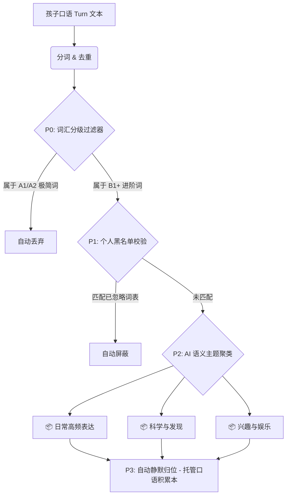

# 功能提议书：对话派生词汇管理交互升级 (高级版规划)

本篇文档用于记录和规划 talking-text 教材整理工作台中的 **“练习里冒出的新词” (Practice-derived Spoken Candidates)** 模块在高级版本中的核心业务演进、交互设计与技术落地方案。

---

## 1. 背景与痛点诊断

在基础版设计中，系统实现了极其惊艳的“基于孩子口语对话底稿 (`Turn.text_user`) 实时分词提取存量差集”的功能。这让家长能够敏锐捕捉到孩子在课外自学并亲口说出、但当前教材库中却遗漏的词汇。

然而，在实际家庭使用中，该模块暴露了以下高认知负载（Cognitive Overload）的产品痛点：

> [!WARNING]
> **用户的认知与决策瘫痪**：
> 1. **大白话杂音充斥**：孩子在对话中高频说出的基础连词、介词和低阶动词（如 `like`, `want`, `very`, `it's`, `don't`）会塞满候选区。这些词属于孩子无需刻意记忆的“生存词汇”，无需收录进教材。
> 2. **零逻辑无序碎屑**：上百个毫不相干的散词堆砌在一起，家长面对单个输入框“全部归位到哪个教材”，根本无法做出合理的分类决策。

为了让该功能真正达到商业级的高级体验，我们规划了以下 **“渐进式降噪、全自动静默积累与 AI 主题聚类”** 的高级版闭环方案。

---

## 2. 核心演进目标

1. **零认知负载**：免除家长对零散词汇进行手动归档分类的决策压力。
2. **极高纯净度**：保证呈现在界面上的候选词全部是具备较高教学价值的“中高级/内容实词”，杜绝大白话杂音。
3. **全自动静默累积**：建立静默收割流水线，实现“对话即吸收”，无需人工干预。

---

## 3. 高级版功能设计 (Feature Specifications)



### 🎯 阶段一：多级停用词与低阶词汇自动过滤 (P0)
* **业务逻辑**：引入成熟的词表等级数据库（例如 CEFR 词表或通用英语最常用前 2000 基础词汇）。
* **技术实现**：在分词匹配后，自动将处于 A1 级别的超低阶生存词、代词和功能词进行源头过滤。
* **用户体验**：列表数量从上百个骤减到二三十个，且过滤后留下的全部是 `whenever`, `absolutely`, `cartoon`, `fighting` 等真正具备沉淀和针对性练习价值的进阶词。

### 🎯 阶段二：个别排除与黑名单持久化 (P1)
* **业务逻辑**：家长拥有对单个候选词进行微调过滤的控制权。
* **交互设计**：
  * 每个新词胶囊右侧提供一个小巧的 `×` 按钮。
  * 家长点击 `×` 时，系统将该词标记为 “Ignore (忽略)”，并将其永久写入该账户的 **忽略词表 (Ignore List / Blacklist)** 中。
* **技术实现**：
  * 新建表 `learner_ignored_items`，保存 `(learner_id, text, ignored_at)`。
  * 在 inbox 接口查询时，将黑名单词库一并做差集剔除。

### 🎯 阶段三：托管型“全自动口语积累本” (P2)
* **业务逻辑**：将“手动整理”弱化为后台自动化的常态流水线。
* **交互设计**：
  * 系统默认在教材大纲中托管生成一本 **“口语成长日记 (My Spoken Dictionary)”** 树形教材。
  * 家长无需手动给新词填路径，系统会自动、静默地把孩子说出的合格新词按“月份/周”归入该积累本。
* **用户体验**：家长可以在完全不干预的情况下，看到孩子的口语表达集在按时间线自动滚动扩容。

### 🎯 阶段四：AI 主题聚类成包 (P3)
* **业务逻辑**：使用大语言模型（LLM）将散词转化为结构化主题。
* **交互设计**：
  * 摒弃传统的散列表展示，由 AI 将提取到的新词实时归类为有意义的 **“兴趣主题包 (Thematic Bags)”**。
  * 示例：
    * 📂 **「运动与拼搏」**：`fighting`, `watch`, `absolutely`
    * 📂 **「情绪与状态」**：`mean`, `favorite`, `feel`
    * 📂 **「故事与娱乐」**：`cartoon`, `movie`, `films`
  * 家长可以按“主题包”一键整组收录，让教材的搭建拥有高度的语义化逻辑。

---

## 4. 后端数据库扩展草案 (Database Schema Draft)

为了实现个人忽略词功能，我们需要新建一张忽略黑名单表：

```sql
CREATE TABLE learner_ignored_item (
    id UUID PRIMARY KEY DEFAULT gen_random_uuid(),
    learner_id UUID NOT NULL REFERENCES learner(id) ON DELETE CASCADE,
    text VARCHAR(100) NOT NULL,
    created_at TIMESTAMP WITH TIME ZONE DEFAULT timezone('utc'::text, now()) NOT NULL,
    CONSTRAINT uq_learner_ignored_item_text UNIQUE (learner_id, text)
);

CREATE INDEX idx_learner_ignored_item_lookup ON learner_ignored_item(learner_id, text);
```

---

## 5. 接口契约草案 (API Contract Draft)

### 1. 将新词移入忽略词库
* **请求**：`POST /organize/dismiss-candidate`
* **Payload**：
  ```json
  {
    "learner_id": "366733fd-7de8-4033-9b02-2935d2874f45",
    "text": "like"
  }
  ```
* **响应**：`204 No Content`

### 2. 获取聚类后的候选包
* **请求**：`GET /organize/inbox` (升级后的返回 payload)
* **响应**：
  ```json
  {
    "learner_id": "...",
    "capture_bags": [...],
    "practice_candidates_grouped": [
      {
        "theme_name": "兴趣与娱乐",
        "items": [
          { "text": "cartoon", "count": 2 },
          { "text": "films", "count": 2 }
        ]
      }
    ]
  }
  ```

---

> [!NOTE]
> **版本定义**：
> 本篇所载功能确立为 talking-text 发行版的高级增值模块 (Premium Extension)。在目前的 V1 基础版中，我们将保持当前的差集过滤算力底座，待进入下一核心产品迭代周期时，以此文档为大纲快速启动该功能的开发落地。
